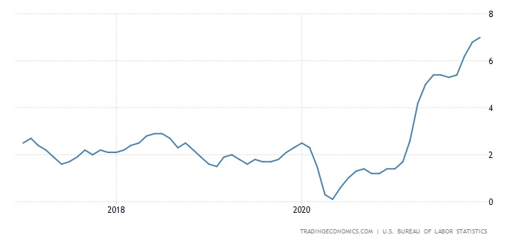
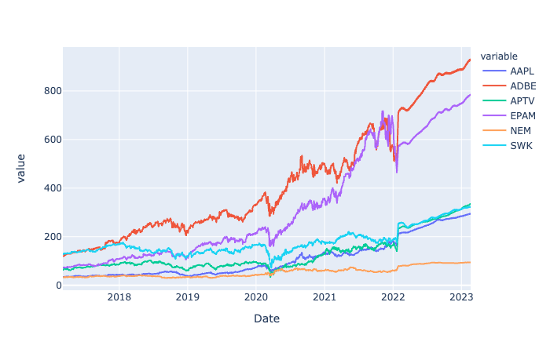

# 10 Best Inflation-Proof Stocks

## Summary

In periods of hyperinflation is essential to position your portfolio in assets that are "inflation-proof"

According to the latest figures issued by the US Department of Labor, inflation in the United States reached a three-decade high last month, with prices of consumer goods and services rising by 7% year over year.

Energy production bottlenecks, supply chain disruptions, and a post-pandemic boost in demand have all contributed to the rise in food, gas, and housing prices. Inflation worries are also weakening pay and job increases that had aided the economy's faster-than-expected recovery from the coronavirus crisis.

## Business Problem

Despite the Federal Reserve's repeated denials of requests to raise interest rates, referring to inflation fears as "transitory," the political repercussions of rising prices may eventually force the government to act. The stock market has responded gingerly to the news, with the benchmark S&amp;P 500 index not dropping immediately. Morgan Stanley, on the other hand, anticipates that if nothing changes, the index might fall by as much as 20% in the following months. In the current environment, investors are rushing to protect their growth-oriented portfolios against danger.

Traditional wisdom holds that dividend-paying, stable firms in the value category, together with gold, are the best inflation hedges. However, the economy has altered so dramatically in recent years that the meaning of "value stock" has shifted as well. Before purchasing for a crisis, investors should think about pricing power and worldwide market reach.Viewed in this context, some of the top inflation-proof stocks to buy now include Apple Inc. (NASDAQ:AAPL), Adobe Inc. (NASDAQ:ADBE), and MercadoLibre, Inc. (NASDAQ:MELI), among others modeled within this project

The intent of the timeseries model is to predict the risk and potential return on investment for a small sized portfolio that wishes to diversify itself within times of hyperinflation

## Data

The stocks analyzed and modeled using facebook's fbprophet are the following:

AAPL

SWK

NEM

EPAM

APTV

ADBE

FRT

MO

TTD

MELI

## Results

After traing a fbprophet model, the top performing stocks with the greatest ROI and lowest RMSE where the following:

AAPL - ROI: 47.4% | RMSE: 33.6

ADBE - ROI: 55% | RMSE: 70.9

APTV - ROI: 43.2% | RMSE: 30.4

EPAM - ROI: 46.8% | RMSE: 81.31

NEM - ROI: 65.6% | RMSE: 15.5

SWK - ROI: 57.7% | RMSE: 36.5

